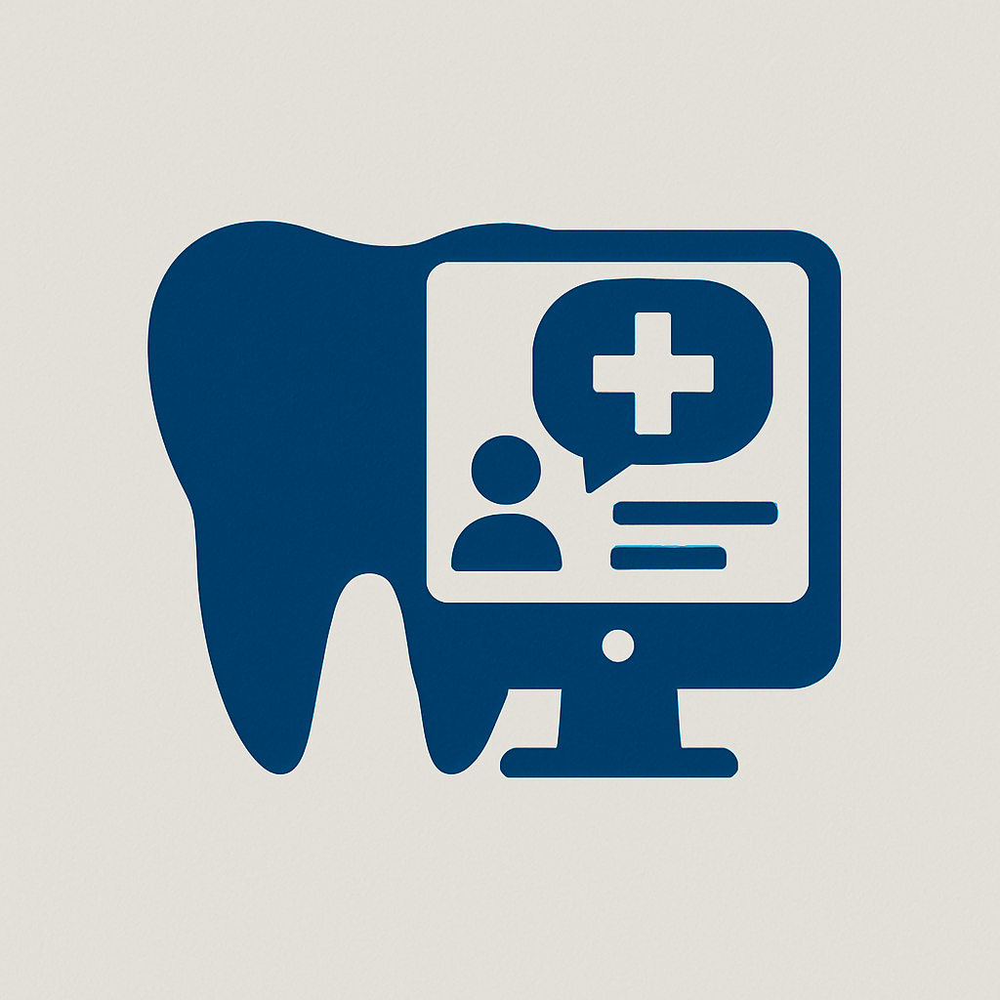
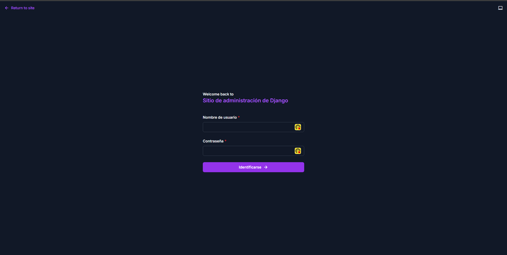
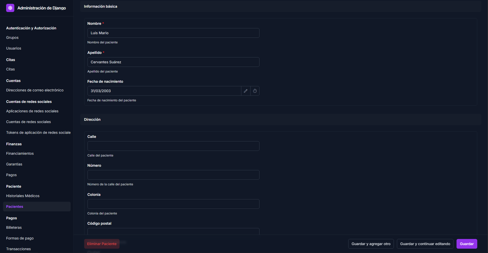
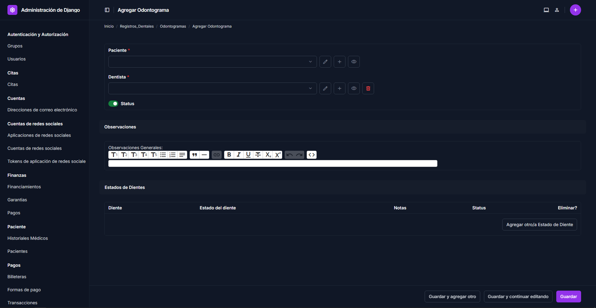
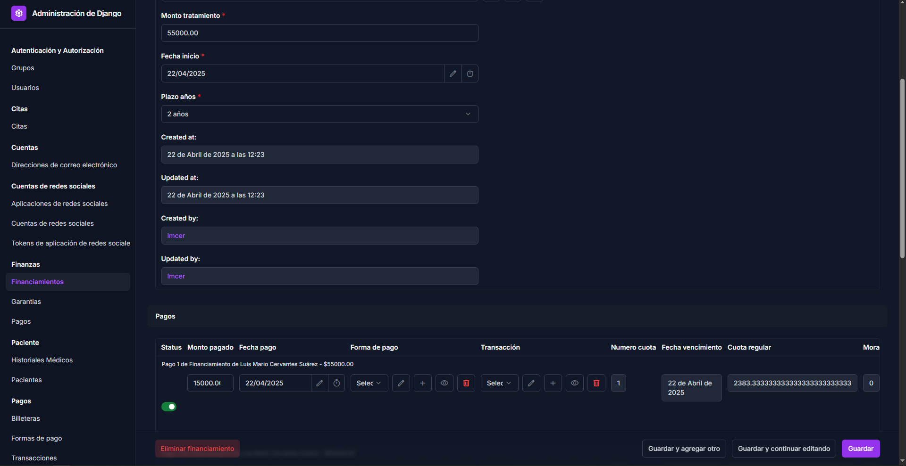

# 🦷 Sistema de Gestión Dental - Manual de Usuario

## 📋 Contenido

1. [Introducción](#-introducción)
2. [Primeros Pasos](#-primeros-pasos)
3. [Gestión de Pacientes](#-gestión-de-pacientes)
4. [Gestión de Citas](#-gestión-de-citas)
5. [Registros Dentales](#-registros-dentales)
6. [Tratamientos](#-tratamientos)
7. [Gestión Financiera](#-gestión-financiera)
8. [Pagos y Transacciones](#-pagos-y-transacciones)
9. [Reportes y Estadísticas](#-reportes-y-estadísticas)
10. [Preguntas Frecuentes](#-preguntas-frecuentes)

---

## 🌟 Introducción

Bienvenido al **Sistema de Gestión Dental**, una plataforma integral diseñada para optimizar todos los aspectos de la administración de su clínica dental. Este sistema unifica la gestión de pacientes, citas, tratamientos, registros clínicos y aspectos financieros en una interfaz intuitiva y potente.

### ✨ Características Principales

- **Gestión completa de pacientes** con historiales médicos detallados
- **Agendamiento y seguimiento de citas** con múltiples estados
- **Odontogramas digitales** para documentación precisa de la salud bucal
- **Catálogo personalizable de tratamientos** con precios y duración estimada
- **Sistema financiero avanzado** con billeteras, formas de pago y financiamiento
- **Almacenamiento de documentos dentales** (radiografías, fotografías, consentimientos)
- **Reportes y estadísticas** para toma de decisiones basadas en datos

Este sistema está diseñado para satisfacer las necesidades tanto de clínicas pequeñas como de grandes centros odontológicos con múltiples especialistas.

---

## 🚀 Primeros Pasos

### Acceso al Sistema

Para comenzar a utilizar el sistema:

1. Ingrese la URL proporcionada por su administrador en su navegador
2. En la pantalla de inicio de sesión, introduzca:
   - Nombre de usuario
   - Contraseña
3. Haga clic en "Iniciar sesión"

### Navegación Principal

Una vez dentro del sistema, encontrará un panel de administración con acceso a todos los módulos:

- **Pacientes**: Gestión de información de pacientes
- **Citas**: Programación y seguimiento de consultas
- **Registros Dentales**: Odontogramas y documentación clínica
- **Tratamientos**: Catálogo y seguimiento de procedimientos
- **Finanzas**: Gestión de pagos y financiamiento
- **Configuración**: Ajustes del sistema (solo para administradores)

> 💡 **Consejo**: El menú de navegación siempre está disponible en la parte superior de la pantalla, permitiéndole cambiar entre módulos rápidamente.

---

## 👨‍👩‍👧‍👦 Gestión de Pacientes

El módulo de pacientes es el corazón del sistema, permitiéndole mantener información detallada de cada persona que atiende en su clínica.

### Registro de Nuevos Pacientes

Para crear un nuevo registro de paciente:

1. Navegue a **Pacientes** > **Añadir nuevo**
2. Complete la información a través del asistente de 4 pasos:
   - **Paso 1**: Información básica (nombre, apellido, fecha nacimiento)
   - **Paso 2**: Dirección (calle, número, colonia, CP, ciudad)
   - **Paso 3**: Información de contacto (teléfono, celular, email)
   - **Paso 4**: Información de crédito (límite, saldo)

El asistente muestra una barra de progreso para guiarlo a través del proceso completo.

### Historial Médico

Cada paciente puede tener un historial médico completo:

1. Desde la ficha del paciente, vaya a la sección **Historial Médico**
2. Haga clic en **Añadir** si es nuevo o **Editar** si desea actualizar
3. Registre información sobre:
   - Alergias
   - Condiciones médicas
   - Medicamentos actuales
   - Medicamentos pasados
   - Tipo de sangre
   - Notas adicionales

> ⚠️ **Importante**: El historial médico es crucial para la seguridad del paciente. Actualícelo regularmente durante las consultas.

### Búsqueda y Filtrado de Pacientes

Para localizar rápidamente a un paciente:

1. En la lista de pacientes, utilice el campo de búsqueda en la parte superior
2. Puede buscar por nombre, apellido, teléfono o email
3. También puede filtrar por fecha de nacimiento o límite de crédito usando los filtros laterales

---

## 📅 Gestión de Citas

El módulo de citas permite organizar eficientemente la agenda de su clínica y dar seguimiento a cada consulta.

### Programación de Citas

Para agendar una nueva cita:

1. Vaya a **Citas** > **Añadir nueva**
2. Complete el formulario con:
   - Paciente (búsqueda por nombre)
   - Dentista asignado
   - Fecha y hora de inicio
   - Duración estimada (el sistema calculará la hora de finalización)
   - Motivo de consulta
   - Notas adicionales
3. Guarde la cita para añadirla al calendario

### Estados de las Citas

Las citas pueden tener varios estados que reflejan su progreso:

- **🔵 Programada**: Cita agendada inicialmente
- **🟢 Confirmada**: Verificada con el paciente
- **🟠 En Progreso**: Paciente siendo atendido
- **✅ Completada**: Atención finalizada
- **❌ Cancelada**: Cita anulada
- **⚪ No Asistió**: Paciente ausente

Para cambiar el estado:

1. Desde la lista de citas, seleccione la cita
2. Cambie el estado en el menú desplegable
3. Guarde los cambios

### Vista de Calendario

Para visualizar todas las citas programadas:

1. Vaya a **Citas** > **Calendario**
2. Navegue entre diferentes vistas:
   - Día
   - Semana
   - Mes
3. Filtre por dentista o estado de cita según necesite

> 💡 **Consejo**: La vista de calendario por día es ideal para recepcionistas, mientras que la vista por semana ayuda a los dentistas a planificar.

---

## 🦷 Registros Dentales

Este módulo permite documentar de manera precisa la salud bucal del paciente a través de odontogramas y condiciones dentales detalladas.

### Odontogramas

Los odontogramas son representaciones gráficas de la dentadura del paciente:

1. Vaya a **Registros Dentales** > **Odontogramas**
2. Seleccione **Añadir nuevo** o elija un odontograma existente
3. Seleccione el paciente y el dentista
4. Guarde para crear el registro base

### Estados de Dientes

Para registrar el estado de cada diente:

1. Dentro del odontograma, seleccione **Añadir estado de diente**
2. Seleccione el diente del catálogo
3. Elija el estado:
   - Presente
   - Ausente
   - Implante
   - Temporal
   - Para extraer
4. Añada notas si es necesario
5. Guarde el registro

### Condiciones Dentales

Para documentar problemas específicos:

1. Seleccione el estado del diente al que desea añadir una condición
2. Haga clic en **Añadir condición dental**
3. Seleccione:
   - Tipo de condición (caries, restauración, corona, etc.)
   - Superficie afectada (si aplica)
   - Estado de la condición
   - Descripción detallada
4. Guarde la condición

### Documentos Dentales

El sistema permite almacenar diferentes tipos de documentos:

1. Vaya a **Registros Dentales** > **Documentos**
2. Haga clic en **Añadir documento**
3. Complete la información:
   - Paciente
   - Tipo de documento (radiografía, panorámica, fotografía, etc.)
   - Título y descripción
   - Archivo (suba desde su computadora)
   - Dientes relacionados (opcional)
4. Guarde el documento

> 🔍 **Ventaja**: Asociar documentos con dientes específicos permite una localización más rápida cuando se revisa el historial del paciente.

---

## 💉 Tratamientos

Este módulo gestiona el catálogo de servicios odontológicos y los procedimientos realizados a cada paciente.

### Categorías de Tratamientos

Para organizar mejor su oferta de servicios:

1. Vaya a **Tratamientos** > **Categorías**
2. Cree categorías como:
   - Preventivos
   - Restaurativos
   - Endodoncia
   - Cirugía
   - Ortodoncia
   - Estética
3. Asigne un código de color para identificación visual

### Catálogo de Tratamientos

Para añadir un nuevo tratamiento al catálogo:

1. Vaya a **Tratamientos** > **Catálogo**
2. Haga clic en **Añadir tratamiento**
3. Complete la información:
   - Nombre y descripción
   - Categoría
   - Precio base
   - Duración estimada en minutos
   - Si requiere laboratorio, marque la casilla y añada el precio
4. Guarde el tratamiento

### Registro de Tratamientos Realizados

Para documentar un tratamiento aplicado:

1. Vaya a **Tratamientos** > **Tratamientos realizados**
2. Haga clic en **Añadir nuevo**
3. Seleccione:
   - Cita asociada
   - Tratamiento del catálogo
   - Dentista que realizó el procedimiento
   - Precio aplicado (puede diferir del precio base por descuentos)
   - Fechas y horas de inicio y fin
   - Estado del tratamiento
4. Añada notas sobre el procedimiento
5. Guarde el registro

> 📊 **Nota**: El sistema calculará automáticamente la duración real del tratamiento para análisis de eficiencia.

---

## 💰 Gestión Financiera

El módulo financiero permite controlar todos los aspectos económicos de la clínica.

### Financiamiento de Tratamientos

Para pacientes que requieren planes de pago:

1. Vaya a **Finanzas** > **Financiamientos**
2. Haga clic en **Añadir financiamiento**
3. Seleccione el paciente
4. Añada información de garantía (si aplica)
5. Registre:
   - Monto total del tratamiento
   - Fecha de inicio
   - Plazo en años (1-3 años)
6. El sistema calculará:
   - Anticipo requerido (35%)
   - Saldo a financiar
   - Tasa de interés según el plazo
7. Guarde y genere el plan de pagos

### Plan de Pagos

Para visualizar o generar el plan de cuotas:

1. Seleccione el financiamiento deseado
2. Use la acción **Generar plan de pagos**
3. El sistema creará automáticamente las cuotas mensuales con:
   - Número de cuota
   - Fecha de vencimiento
   - Monto a pagar
   - Campos para registrar el pago cuando se realice

### Registro de Pagos

Para registrar un pago de cuota:

1. Seleccione la cuota correspondiente
2. Complete:
   - Monto pagado
   - Fecha de pago
   - Forma de pago
3. Al guardar, el sistema automáticamente:
   - Registra el pago
   - Calcula mora si hay atraso
   - Genera una transacción en el sistema de pagos

---

## 💵 Pagos y Transacciones

Este módulo organiza la estructura financiera y todas las transacciones de la clínica.

### Billeteras y Formas de Pago

El sistema organiza las finanzas mediante:

1. **Billeteras**: Agrupaciones principales (Efectivo, Bancos, etc.)
   - Cree billeteras en **Pagos** > **Billeteras**
   
2. **Formas de pago**: Métodos específicos dentro de cada billetera
   - Por ejemplo, dentro de "Bancos" puede tener diferentes cuentas
   - Configure en **Pagos** > **Formas de pago**

### Registro de Transacciones

Para registrar movimientos de dinero:

1. Vaya a **Pagos** > **Transacciones**
2. Haga clic en **Añadir transacción**
3. Seleccione:
   - Fecha
   - Forma de pago
   - Monto
   - Tipo de movimiento (entrada o salida)
   - Concepto
   - Referencia (opcional)
4. Guarde la transacción

El sistema actualizará automáticamente los balances de cada forma de pago y billetera.

### Monitoreo de Balances

Para verificar el estado financiero:

1. Vaya a **Pagos** > **Billeteras** o **Formas de pago**
2. Observe los indicadores visuales:
   - 🟢 Verde: Entradas (ingresos)
   - 🔴 Rojo: Salidas (gastos)
   - 🔵 Azul: Balance actual

> 💡 **Consejo**: Revise los balances de forma diaria para mantener un control preciso de las finanzas de la clínica.

---

## 📊 Reportes y Estadísticas

El sistema ofrece diversas herramientas para analizar el desempeño de la clínica.

### Reportes Financieros

Para generar reportes de ingresos y gastos:

1. Vaya a **Pagos** > **Reportes**
2. Seleccione el tipo de reporte:
   - Ingresos por periodo
   - Gastos por categoría
   - Balance general
3. Especifique el rango de fechas
4. Genere el reporte para visualizar o exportar

### Estadísticas de Tratamientos

Para analizar los tratamientos más realizados:

1. Vaya a **Tratamientos** > **Estadísticas**
2. Visualice:
   - Tratamientos más frecuentes
   - Ingresos por tipo de tratamiento
   - Tiempos promedio de ejecución
   - Comparativas mensuales

### Productividad por Dentista

Para evaluar el rendimiento del personal:

1. Vaya a **Reportes** > **Productividad**
2. Seleccione el periodo
3. Visualice por dentista:
   - Número de citas atendidas
   - Tratamientos realizados
   - Ingresos generados
   - Tasa de cumplimiento de citas

---

## ❓ Preguntas Frecuentes

### 🤔 ¿Cómo recupero mi contraseña?

En la pantalla de inicio de sesión, haga clic en el enlace "¿Olvidó su contraseña?" y siga las instrucciones enviadas a su correo electrónico.

### 📱 ¿Puedo acceder desde dispositivos móviles?

Sí, el sistema está optimizado para funcionar en teléfonos y tablets. La interfaz se adapta automáticamente al tamaño de la pantalla.

### 🔄 ¿Cómo cambio el estado de una cita?

Seleccione la cita en la lista, cambie el estado en el menú desplegable y guarde los cambios. También puede hacerlo directamente desde la vista de detalles de la cita.

### 🖨️ ¿Puedo imprimir un odontograma?

Sí, en la vista del odontograma, use el botón "Imprimir" para generar un PDF que puede imprimir o guardar.

### 📅 ¿Es posible programar citas recurrentes?

Actualmente, las citas deben programarse individualmente, pero puede usar la función "Duplicar cita" para crear rápidamente una nueva cita con la misma información.

### 💲 ¿Cómo aplico un descuento a un tratamiento?

Al registrar un tratamiento realizado, puede modificar el campo "Precio aplicado" para reflejar el descuento. El sistema mantiene registro tanto del precio base como del precio aplicado.

### 📄 ¿El sistema permite generar presupuestos?

Sí, puede crear un presupuesto seleccionando los tratamientos propuestos e imprimirlo desde la sección de reportes.

### 🔒 ¿Es segura la información de los pacientes?

El sistema implementa múltiples capas de seguridad, incluyendo acceso basado en roles, encriptación de datos sensibles y registro detallado de todas las acciones realizadas.

---

*Este manual busca ser una guía completa para aprovechar al máximo todas las funcionalidades del Sistema de Gestión Dental. Para formación adicional, consulte los videos tutoriales disponibles en nuestra plataforma de aprendizaje.*

© 2025 Sistema de Gestión Dental. Todos los derechos reservados.